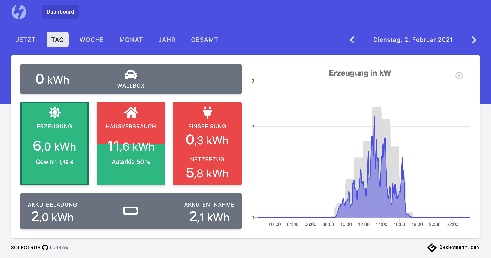

[](https://github.com/solectrus/solectrus/actions)
[](https://codeclimate.com/repos/5fe98897e985f4018b001e7d/maintainability)
[](https://codeclimate.com/repos/5fe98897e985f4018b001e7d/test_coverage)

# Solectrus

Photovoltaic Dashboard, read here about the motivation (in german):
https://ledermann.dev/blog/2021/02/03/photovoltaik-dashboard-als-web-applikation/



## Installation

For self-hosting Solectrus, please look at https://github.com/solectrus/hosting

## Development

```bash
git clone git@github.com:solectrus/solectrus.git
cd solectrus
bin/setup
bin/dev
```

Then open http://localhost:3000 in your browser.

## Test

After preparing development environment (see above):

```bash
bin/influxdb-restart.sh
bin/rspec
```

## License

Copyright (c) 2020-2021 Georg Ledermann, released under the AGPL-3.0 License
