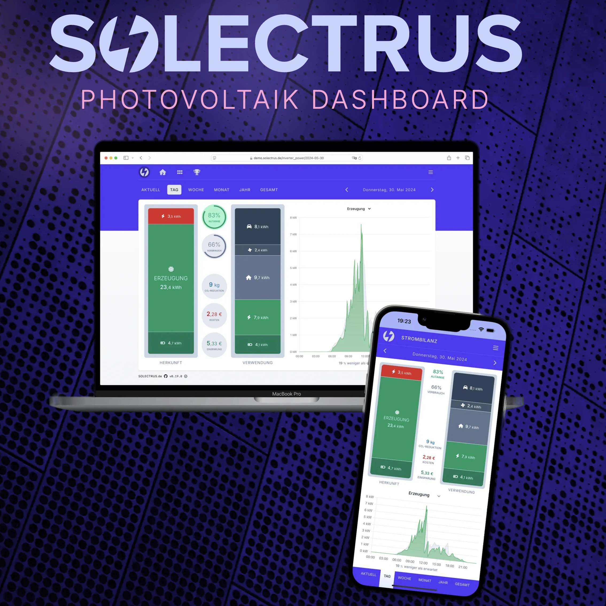

[](https://github.com/solectrus/solectrus/actions)
[](https://codeclimate.com/repos/5fe98897e985f4018b001e7d/maintainability)
[](https://codeclimate.com/repos/5fe98897e985f4018b001e7d/test_coverage)
[](https://wakatime.com/badge/user/697af4f5-617a-446d-ba58-407e7f3e0243/project/ce8d6e54-7457-42e5-94a3-33a9d4021d45)

# SOLECTRUS

SOLECTRUS is your smart solar dashboard, giving you real‑time insights into energy generation and consumption. It automatically calculates costs and savings, so you can maximize the performance of your PV system.



## Live Demo

Try it out at https://demo.solectrus.de

## Installation

SOLECTRUS is a self‑hosted solution — just bring your own server (a Raspberry Pi works great, but any Linux box will do). To get started, visit https://configurator.solectrus.de/ and generate your Docker configuration interactively.

## Development

To contribute, set up a local development environment (this guide assumes macOS with Homebrew):

1. Clone the repository:

```bash
git clone git@github.com:solectrus/solectrus.git
cd solectrus
```

2. Install PostgreSQL, Redis, and puma-dev (if not already present). On a Mac with HomeBrew, run this to install from the `Brewfile`:

```bash
brew bundle
```

Ensure that PostgreSQL is running:

```bash
brew services start postgresql@17
```

3. Install and set up [puma-dev](https://github.com/puma/puma-dev) to use HTTPS for development. Do this on macOS:

```bash
sudo puma-dev -setup
puma-dev -install
puma-dev link

# Use Vite via puma-dev proxy
# Adopted from https://github.com/puma/puma-dev#webpack-dev-server
echo 3036 > ~/.puma-dev/vite.solectrus
```

4. Setup the application to install gems and NPM packages and create the database:

```bash
bin/setup
```

5. Start the application locally:

```bash
bin/dev
```

This starts the app and opens https://solectrus.test in your default browser (see `Procfile.dev`).

### Testing

After preparing development environment (see above):

```bash
bin/influxdb-restart.sh
DISABLE_SPRING=1 bin/rspec
DISABLE_SPRING=1 RAILS_ENV=test bin/rake cypress:run
open coverage/index.html
```

RuboCop:

```
bin/rubocop
```

ESLint:

```
bin/yarn lint
```

TypeScript:

```
bin/yarn tsc
```

There is a shortcut to run **all** test and linting tools:

```bash
bin/test
```

## Performance Monitoring

The [Live Demo](https://demo.solectrus.de) is hosted at Hetzner Cloud. For performance monitoring, it uses [RorVsWild](https://www.rorvswild.com), which is free for OpenSource projects. You can see internal metrics like CPU, memory, and disk usage, as well as request times and errors here:
https://www.rorvswild.com/applications/136101/requests

## License

© 2020–2025 Georg Ledermann. Released under AGPL-3.0.
